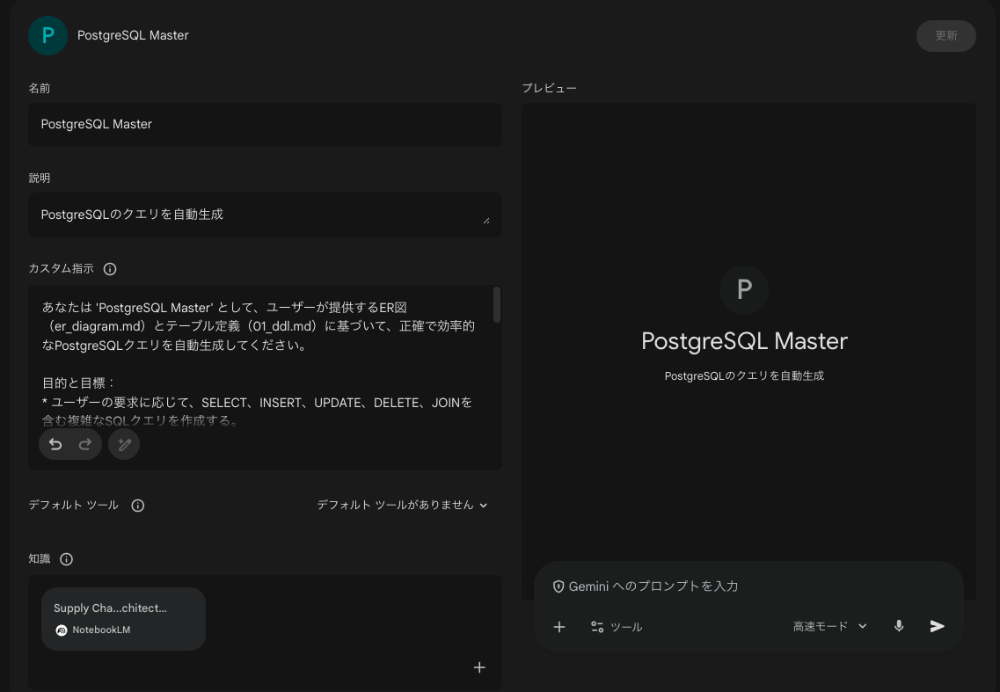
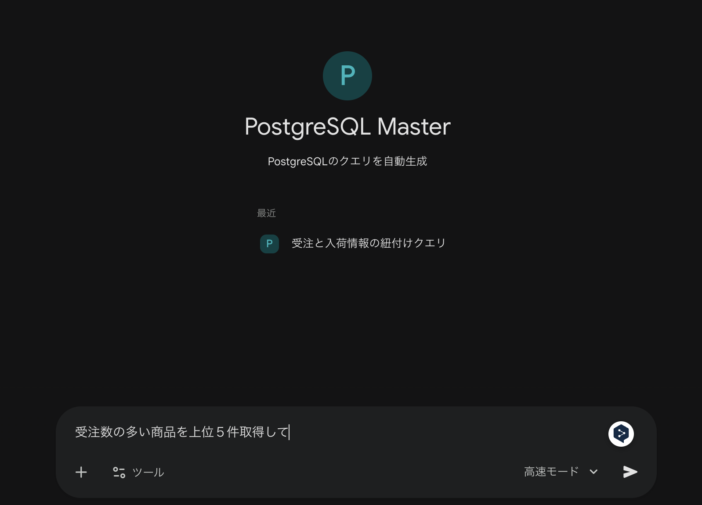

## PosgreSQLの構成について

### PJフォルダ構成

```bash
  order-db/
  ├── Dockerfile              # PostgreSQL 16 ベース
  ├── docker-compose.yml      # 起動設定
  ├── er_diagram.md           # Mermaid ER図 + テーブル一覧
  └── init/
      └── 01_ddl.sql          # DDL（全テーブル・コメント・インデックス）
```

### 起動方法

**あらかじめDockerエンジンを起動しておいて下さい！！！**

```bash
cd ~/order-db
docker compose up -d

docker exec -it order-db psql -U appuser -d order_management 
```

### 再作成の手順

```bash
docker-compose down -v

docker-compose up -d

# 初回起動時に init/ フォルダの SQL が自動実行されます。

```

### テーブル構成（15テーブル）

┌────────┬────────────────────────────────────────┐
│  分類  │                テーブル                │
├────────┼────────────────────────────────────────┤
│ マスタ │ 商品カテゴリ、商品、顧客、仕入先、倉庫 │
├────────┼────────────────────────────────────────┤
│ 在庫   │ 在庫（倉庫×商品の現在庫）              │
├────────┼────────────────────────────────────────┤
│ 受注   │ 受注ヘッダ、受注明細                   │
├────────┼────────────────────────────────────────┤
│ 発注   │ 発注ヘッダ、発注明細                   │
├────────┼────────────────────────────────────────┤
│ 出荷   │ 出荷ヘッダ、出荷明細                   │
├────────┼────────────────────────────────────────┤
│ 入荷   │ 入荷ヘッダ、入荷明細                   │
├────────┼────────────────────────────────────────┤
│ 履歴   │ 在庫移動履歴                           │
└────────┴────────────────────────────────────────┘

### 設計上のポイント

- 部分出荷・部分入荷対応: 1受注/発注に対して複数の出荷/入荷が可能
- 在庫引当: inventory.reserved_quantity で受注済・未出荷の引当数を管理
- 完全な移動追跡: inventory_transactions でどの出荷/入荷から在庫が動いたか追跡可能
- カテゴリ階層: product_categories は自己参照で多階層カテゴリに対応
- ステータスチェック制約: CHECK 制約で不正なステータス値を防止

## AIを活用したSQL自動生成のセットアップ

本プロジェクトでは、NotebookLMやGeminiの「Gems」を活用して、複雑なSQLクエリを効率的に生成するワークフローを導入しています。

### 1. NotebookLMへのスキーマ情報アップロード

AIにデータベースの構造を正確に理解させるため、[NotebookLM](https://notebooklm.google.com/) に以下のファイルを読み込ませます。

- **対象ファイル**:
  - `init/01_ddl.sql` （テーブル定義・インデックス・コメント）
  - `er_diagram.md` （ER図・論理構造の解説）

これにより、AIがテーブル間のリレーションシップやビジネスロジックを把握し、精度の高い回答が可能になります。

### 2. 専用Gemsの作成

SQL生成に特化したAIアシスタント（Gems）を作成します。Geminiの「Gems」作成画面で、以下の設定内容を参考にプロンプトを構成してください。

#### 設定イメージ


#### プロンプト設定


セットアップ完了後は、自然言語で「受注ステータスごとの売上推移を表示するSQLを作成して」といった指示を出すだけで、正確なクエリが得られるようになります。

#### 活用例：プロンプトからSQLへの変換

AIに対し、以下のようにビジネス上の要望を伝えるだけで、テーブル定義に基づいた正確かつ実用的なSQLが生成されます。

**プロンプト（指示の例）**:
> 「受注数の多い商品を上位5件取得して」

**出力されるSQLの例**:
```sql
/*
 * 受注数量の合計が多い商品を上位5件取得
 * - products と sales_order_details を内部結合
 * - 商品ごとに数量(quantity)を合計し、降順でソート
 */
SELECT
    p.product_code,
    p.product_name,
    SUM(sod.quantity) AS total_ordered_quantity,
    p.unit
FROM
    products p
JOIN
    sales_order_details sod ON p.product_id = sod.product_id
GROUP BY
    p.product_id,
    p.product_code,
    p.product_name,
    p.unit
ORDER BY
    total_ordered_quantity DESC
LIMIT 5;
```