# 受発注・入出荷管理システム ER図

```mermaid
erDiagram

    %% =====================
    %% マスタテーブル
    %% =====================

    product_categories {
        int     category_id         PK "カテゴリID"
        varchar category_code          "カテゴリコード"
        varchar category_name          "カテゴリ名"
        int     parent_category_id  FK "親カテゴリID"
        int     sort_order             "表示順"
        timestamp created_at          "登録日時"
        timestamp updated_at          "更新日時"
    }

    products {
        int     product_id       PK "商品ID"
        varchar product_code        "商品コード"
        varchar product_name        "商品名"
        int     category_id      FK "カテゴリID"
        varchar unit                "単位"
        numeric unit_price          "販売単価"
        numeric cost_price          "仕入単価"
        numeric tax_rate            "消費税率(%)"
        int     lead_time_days      "発注リードタイム(日)"
        bool    is_active           "有効フラグ"
        timestamp created_at       "登録日時"
        timestamp updated_at       "更新日時"
    }

    customers {
        int     customer_id      PK "顧客ID"
        varchar customer_code       "顧客コード"
        varchar customer_name       "顧客名"
        varchar customer_kana       "顧客名カナ"
        varchar postal_code         "郵便番号"
        text    address             "住所"
        varchar phone               "電話番号"
        varchar email               "メールアドレス"
        varchar payment_terms       "支払条件"
        numeric credit_limit        "与信限度額"
        bool    is_active           "有効フラグ"
        timestamp created_at       "登録日時"
        timestamp updated_at       "更新日時"
    }

    suppliers {
        int     supplier_id      PK "仕入先ID"
        varchar supplier_code       "仕入先コード"
        varchar supplier_name       "仕入先名"
        varchar supplier_kana       "仕入先名カナ"
        varchar postal_code         "郵便番号"
        text    address             "住所"
        varchar phone               "電話番号"
        varchar email               "メールアドレス"
        varchar payment_terms       "支払条件"
        bool    is_active           "有効フラグ"
        timestamp created_at       "登録日時"
        timestamp updated_at       "更新日時"
    }

    warehouses {
        int     warehouse_id     PK "倉庫ID"
        varchar warehouse_code      "倉庫コード"
        varchar warehouse_name      "倉庫名"
        text    address             "所在地"
        varchar phone               "電話番号"
        bool    is_active           "有効フラグ"
        timestamp created_at       "登録日時"
        timestamp updated_at       "更新日時"
    }

    %% =====================
    %% 在庫テーブル
    %% =====================

    inventory {
        int     inventory_id      PK "在庫ID"
        int     product_id        FK "商品ID"
        int     warehouse_id      FK "倉庫ID"
        numeric quantity             "現在庫数量"
        numeric reserved_quantity   "引当済数量"
        timestamp updated_at        "更新日時"
    }

    %% =====================
    %% 受注テーブル
    %% =====================

    sales_orders {
        int     sales_order_id       PK "受注ID"
        varchar sales_order_no          "受注番号"
        int     customer_id          FK "顧客ID"
        date    order_date              "受注日"
        date    desired_delivery_date   "希望納品日"
        text    delivery_address        "納品先住所"
        varchar status                  "ステータス"
        numeric total_amount            "合計金額(税抜)"
        numeric total_tax_amount        "消費税合計"
        timestamp created_at           "登録日時"
        timestamp updated_at           "更新日時"
    }

    sales_order_details {
        int     detail_id        PK "明細ID"
        int     sales_order_id   FK "受注ID"
        int     line_no             "行番号"
        int     product_id       FK "商品ID"
        numeric quantity            "受注数量"
        numeric unit_price          "受注単価"
        numeric tax_rate            "消費税率"
        numeric amount              "金額"
        numeric shipped_quantity    "出荷済数量"
        timestamp created_at       "登録日時"
        timestamp updated_at       "更新日時"
    }

    %% =====================
    %% 発注テーブル
    %% =====================

    purchase_orders {
        int     purchase_order_id     PK "発注ID"
        varchar purchase_order_no        "発注番号"
        int     supplier_id           FK "仕入先ID"
        date    order_date               "発注日"
        date    expected_arrival_date    "入荷予定日"
        varchar status                   "ステータス"
        numeric total_amount             "合計金額(税抜)"
        timestamp created_at            "登録日時"
        timestamp updated_at            "更新日時"
    }

    purchase_order_details {
        int     detail_id            PK "明細ID"
        int     purchase_order_id    FK "発注ID"
        int     line_no                 "行番号"
        int     product_id           FK "商品ID"
        numeric quantity                "発注数量"
        numeric unit_price              "発注単価"
        numeric amount                  "金額"
        numeric received_quantity       "入荷済数量"
        timestamp created_at           "登録日時"
        timestamp updated_at           "更新日時"
    }

    %% =====================
    %% 出荷テーブル
    %% =====================

    shipments {
        int     shipment_id      PK "出荷ID"
        varchar shipment_no         "出荷番号"
        int     sales_order_id   FK "受注ID"
        int     warehouse_id     FK "出荷元倉庫ID"
        date    shipment_date       "出荷日"
        varchar status              "ステータス"
        timestamp created_at       "登録日時"
        timestamp updated_at       "更新日時"
    }

    shipment_details {
        int     detail_id               PK "明細ID"
        int     shipment_id             FK "出荷ID"
        int     sales_order_detail_id   FK "受注明細ID"
        int     product_id              FK "商品ID"
        numeric quantity                   "出荷数量"
        timestamp created_at              "登録日時"
    }

    %% =====================
    %% 入荷テーブル
    %% =====================

    receipts {
        int     receipt_id           PK "入荷ID"
        varchar receipt_no              "入荷番号"
        int     purchase_order_id    FK "発注ID"
        int     warehouse_id         FK "入荷先倉庫ID"
        date    receipt_date            "入荷日"
        varchar status                  "ステータス"
        timestamp created_at           "登録日時"
        timestamp updated_at           "更新日時"
    }

    receipt_details {
        int     detail_id                   PK "明細ID"
        int     receipt_id                  FK "入荷ID"
        int     purchase_order_detail_id    FK "発注明細ID"
        int     product_id                  FK "商品ID"
        numeric quantity                       "入荷数量"
        timestamp created_at                  "登録日時"
    }

    %% =====================
    %% 在庫移動履歴
    %% =====================

    inventory_transactions {
        int     transaction_id   PK "移動ID"
        int     product_id       FK "商品ID"
        int     warehouse_id     FK "倉庫ID"
        varchar transaction_type    "移動種別"
        numeric quantity            "変動数量"
        varchar reference_type      "参照元テーブル"
        int     reference_id        "参照元ID"
        date    transaction_date    "移動日付"
        timestamp created_at       "登録日時"
    }

    %% =====================
    %% リレーション定義
    %% =====================

    %% カテゴリ階層（自己参照）
    product_categories ||--o{ product_categories      : "親カテゴリ"

    %% マスタ間リレーション
    product_categories ||--o{ products                : "分類"
    products           ||--o{ inventory               : "在庫"
    warehouses         ||--o{ inventory               : "保管"

    %% 受注フロー
    customers          ||--o{ sales_orders            : "受注"
    sales_orders       ||--|{ sales_order_details     : "明細"
    products           ||--o{ sales_order_details     : "商品"

    %% 発注フロー
    suppliers          ||--o{ purchase_orders         : "発注"
    purchase_orders    ||--|{ purchase_order_details  : "明細"
    products           ||--o{ purchase_order_details  : "商品"

    %% 出荷フロー
    sales_orders       ||--o{ shipments               : "出荷"
    warehouses         ||--o{ shipments               : "出荷元"
    shipments          ||--|{ shipment_details        : "明細"
    sales_order_details ||--o{ shipment_details       : "受注明細"
    products           ||--o{ shipment_details        : "商品"

    %% 入荷フロー
    purchase_orders    ||--o{ receipts                : "入荷"
    warehouses         ||--o{ receipts                : "入荷先"
    receipts           ||--|{ receipt_details         : "明細"
    purchase_order_details ||--o{ receipt_details     : "発注明細"
    products           ||--o{ receipt_details         : "商品"

    %% 在庫移動履歴
    products           ||--o{ inventory_transactions  : "商品"
    warehouses         ||--o{ inventory_transactions  : "倉庫"
```



## テーブル一覧

| # | テーブル名 | 論理名 | 分類 |
|---|-----------|--------|------|
| 1 | product_categories | 商品カテゴリマスタ | マスタ |
| 2 | products | 商品マスタ | マスタ |
| 3 | customers | 顧客マスタ | マスタ |
| 4 | suppliers | 仕入先マスタ | マスタ |
| 5 | warehouses | 倉庫マスタ | マスタ |
| 6 | inventory | 在庫 | 在庫 |
| 7 | sales_orders | 受注ヘッダ | 受注 |
| 8 | sales_order_details | 受注明細 | 受注 |
| 9 | purchase_orders | 発注ヘッダ | 発注 |
| 10 | purchase_order_details | 発注明細 | 発注 |
| 11 | shipments | 出荷ヘッダ | 出荷 |
| 12 | shipment_details | 出荷明細 | 出荷 |
| 13 | receipts | 入荷ヘッダ | 入荷 |
| 14 | receipt_details | 入荷明細 | 入荷 |
| 15 | inventory_transactions | 在庫移動履歴 | 履歴 |

## ステータス遷移

### 受注ステータス
```
受注 → 一部出荷 → 出荷済
受注 → キャンセル
```

### 発注ステータス
```
発注 → 一部入荷 → 入荷済
発注 → キャンセル
```

### 出荷ステータス
```
準備中 → 出荷済
```

### 入荷ステータス
```
入荷予定 → 入荷済
```
